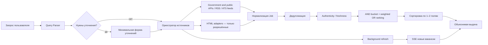

# Архитектура VacationHunter

Дата решений: 2026-07-29.

## Сквозной поток

## Контракт нормализованной вакансии

Обязательный минимум: `id`, `externalId`, `title`, `company`, `description`, `url`, `source`, `postedAt`. Структурные поля: `skills[]`, `location`, `remote`, `relocation`, `visaSponsorship`, `employmentType`, `experience`, `salary {min,max,currency,period}`. Вычисляемые поля: `salaryMonthlyUsd`, `verification`, `matchPercent`, `andMatch`, `scoreBreakdown`, `duplicateCount`, `sourceUrls[]`.

`ApplicationStore` сохраняет отдельный ограниченный snapshot вакансии: идентификатор, название, компанию, ссылки, локацию, зарплату, навыки, источник и verification. Пользовательские поля — `status`, `notes`, `nextActionAt`, `statusChangedAt`, `history[]`. Snapshot не зависит от дальнейшего присутствия объекта в `JobStore`; через HTTP изменяются только три пользовательских поля.

## Разбор запроса

MVP использует детерминированные правила и словари: результат быстрый, тестируемый и объяснимый. Каждый тег имеет:

- тип и нормализованное значение;
- вес важности;
- `required`, определяющий верхнюю AND-группу;
- источник извлечения и возможность уточнения.

LLM-парсер можно добавить как второй адаптер, но его JSON должен валидироваться той же схемой, а результат — проходить детерминированные проверки валюты, периода и противоречий. Это не должно быть единственной логикой продукта.

## Ранжирование

Текущий ранкер специально соответствует пользовательскому примеру:

1. Сначала вакансии, где выполнены все обязательные теги (`andMatch=true`).
2. Внутри группы — релевантность, затем нормализованная зарплата и свежесть.
3. Затем OR-группа: чем больше вес совпавших тегов, тем выше позиция.
4. Неуказанная зарплата не удаляет вакансию, но даёт 0 по зарплатному сигналу.
5. Java-вакансия с $10k не обгоняет .NET-вакансию с $8k по запросу .NET.
6. `suspicious/stale` демотируются ниже безопасных результатов независимо от зарплаты и пользовательской сортировки.

Скоринг MVP: теги 70%, зарплата 15%, свежесть 8%, проверка 5%, качество источника 2%. Все компоненты возвращаются в `scoreBreakdown`.

Production-путь: дешёвый structured filter + BM25 retrieval → semantic retrieval → RRF → бизнес-реранкер. Elastic рекомендует RRF для объединения lexical и semantic выдач без калибровки несовместимых шкал: <https://www.elastic.co/docs/solutions/search/hybrid-search> и <https://www.elastic.co/docs/reference/elasticsearch/rest-apis/reciprocal-rank-fusion>.

## Дедупликация

Каскад, от дешёвого и надёжного к приближённому:

1. `(source_id, external_id)` — уникальный ключ.
2. Canonical URL без tracking-параметров.
3. SHA-256 fingerprint `company + title + location`.
4. Fuzzy Jaccard по title только при одинаковой компании и совместимой локации.

Дубликаты сливаются, а `sources[]`, `sourceUrls[]` и `duplicateCount` сохраняются. Один объект не может одновременно попасть в AND и OR: bucket вычисляется после дедупликации.

## Проверка подлинности и актуальности

Нет одного достоверного признака. Модуль собирает независимые сигналы:

- вакансия пришла из официального API или публичного ATS-фида;
- работодатель помечен источником как trusted или объявление получено с его ATS-board;
- HTTPS URL и путь отклика существуют;
- HTTP 2xx на live-проверке;
- `JobPosting` JSON-LD существует, `validThrough` не истёк;
- источник не помечает вакансию `archived/closed`;
- нет запроса оплаты кандидатом, chat-only контакта, анонимного работодателя и слишком пустого описания.

Google прямо требует удалять истёкшие вакансии либо указывать прошедший `validThrough`, запрещает фиктивные объявления, объявления без способа отклика и требования оплаты: <https://developers.google.com/search/docs/appearance/structured-data/job-posting>.

Live-проверка защищена от SSRF: только HTTPS, DNS lookup, запрет loopback/private/link-local адресов, timeout и лимит размера HTML. В UI статус показывается отдельно от `companyVerified`.

## Сбор и обновление

Порядок выбора интеграции:

1. Официальный API источника.
2. Публичный Job Board API ATS работодателя.
3. RSS/XML/JSON feed с явными условиями атрибуции.
4. Разрешённый HTML-парсер с RFC 9309 robots.txt, rate limit, conditional GET и изолированным адаптером.
5. Если нужна авторизация — официальный OAuth/API key/партнёрство. Обход логина, CAPTCHA, paywall и антибота не является допустимой архитектурой.

MVP выполняет изолированные параллельные запросы с общим лимитом `SOURCE_CONCURRENCY` (по умолчанию 16), timeout/retry только для временных сбоев, сохраняет состояние каждого источника и не ломает общую выдачу при сбое одного коннектора. 401/403 и Cloudflare challenge дают шестичасовой cooldown, 429 учитывает `Retry-After`, остальные ошибки получают экспоненциальную паузу. Повторный refresh во время cooldown возвращает `skipped` и не делает сетевой запрос. CAPTCHA и challenge не обходятся.

Широкое международное покрытие реализуется сочетанием государственных API, агрегаторных API, официальных RSS и публичных ATS, а не эмуляцией пользовательского браузера. Jooble даёт широкий международный охват, «Работа России», JobTech, Arbeidsplassen/NAV и USAJOBS закрывают государственные базы, Remote OK/WWR/HN — remote и community-сегмент, а ATS дают первичные вакансии работодателей. Общая дедупликация объединяет пересечения. HH остаётся необязательным резервным источником. Одинаковые запросы к credential-based API кэшируются, секреты остаются только в окружении сервера.

Инкрементальные lifecycle-feed используют двухфазное применение. Коннектор сохраняет cursor и pending batch с ID изменённых записей, `JobStore.applySourceChanges` сначала удаляет старые версии/неактивные объявления и добавляет новые, и лишь после успешной атомарной записи сервис вызывает `acknowledge(syncToken)`. Если запись на диск или процесс завершается до подтверждения, тот же batch воспроизводится. При дедупликации нескольких источников удаляется весь объединённый объект с затронутым provenance key: это консервативно исключает сохранение устаревшего текста, а другие активные источники восстановят свою версию при следующем refresh.

Операционный API разделяет безопасные метаданные и секреты. `GET /api/sources` отдаёт health, `authType`, имена `credentialFields` и `setupUrl`, но не значения конфигурации. `POST /api/sources/:id/check` адресно запускает один коннектор через тот же timeout/backoff/cooldown-контур; центр источников в UI является клиентом этих двух маршрутов.

Новые вакансии из наблюдений передаются в `NotificationService`. Telegram-адаптер не вызывается напрямую из события UI: сначала `NotificationOutbox` атомарно сохраняет payload и dedupe key, только после этого watch store обновляет `knownJobIds`, затем сериализованный flush выполняет `sendMessage`. Если процесс остановится между двумя записями, следующий refresh повторит постановку, но тот же dedupe key не создаст второе сообщение. Результат доставки переводит запись в `sent`, временная ошибка назначает `nextAttemptAt`, исчерпание попыток — в `failed`.

Операционные маршруты: `GET /api/notifications/status`, `POST /api/notifications/discover`, `POST /api/notifications/test`, `POST /api/notifications/flush`. Статус содержит только булевы признаки конфигурации и счётчики очереди. Bot token существует только в `config`/`TelegramClient` серверного процесса.

Воронка использует `GET/POST /api/applications` и `PATCH/DELETE /api/applications/:jobId`. `ApplicationStore` сериализует atomic rename так же, как остальные локальные хранилища, ограничивает статусы и длину заметки, нормализует дату и записывает историю только при реальной смене этапа. SSE-событие `application` синхронизирует открытые вкладки.

Для пользовательского HH-поиска отдельный `hh-email` коннектор читает официальные уведомления сохранённых автопоисков через IMAP. Он ограничивает отправителей allowlist-доменами, не меняет флаги и не удаляет письма, хранит только UID-курсор, а пароль приложения остаётся в окружении сервера. Из писем извлекаются канонические ID/URL; HTML не рендерится и скрипты не выполняются.

Прямой HH API — отдельный случай конфигурации: коннектор виден как `disabled`, пока оператор не задаст `HH_USER_AGENT` и авторизацию зарегистрированного приложения (`HH_ACCESS_TOKEN` либо пару `HH_CLIENT_ID` + `HH_CLIENT_SECRET`). Это предотвращает циклические анонимные запросы, которые HH может остановить CAPTCHA/403.

Для production:

- PostgreSQL — источник истины и история вакансии;
- OpenSearch/Elasticsearch — BM25, facets, vectors, RRF;
- Redis + BullMQ/Temporal — очереди, retry/backoff, распределённые блокировки;
- object storage — raw snapshots для аудита;
- OpenTelemetry — latency, error rate, freshness lag, parse success;
- DLQ для сломавшихся адаптеров.

## Модель обновлений

- API/ATS: 5–15 минут для активных источников, реже для низкообъёмных.
- HTML: адаптивно 30–180 минут с conditional requests и jitter.
- Вакансия исчезла из полного ATS snapshot: `missing_since`, повторная проверка, затем `closed`.
- Пользователь включает «следить»: запрос сохраняется в `data/watch-store.json`, после перезапуска снова участвует в фоновых обновлениях, новые данные публикуются через SSE и при настроенном канале попадают в durable Telegram delivery. Это локальная однопользовательская реализация; email и multi-user routing остаются следующими отдельными модулями.

## Метрики качества

- `nDCG@10`, `MRR`, `Recall@50` по размеченному набору запросов;
- доля полных AND-совпадений в top-10;
- duplicate rate до/после merge;
- stale rate и false-positive verification;
- p50/p95 latency, source freshness lag, connector success rate;
- conversion: open → apply, с поправкой на позицию.

Перед обучением весов нужен набор: запрос, вакансия, оценка 0–3, причина, факт отклика/интервью. До этого детерминированный скоринг честнее непрозрачного ML.
